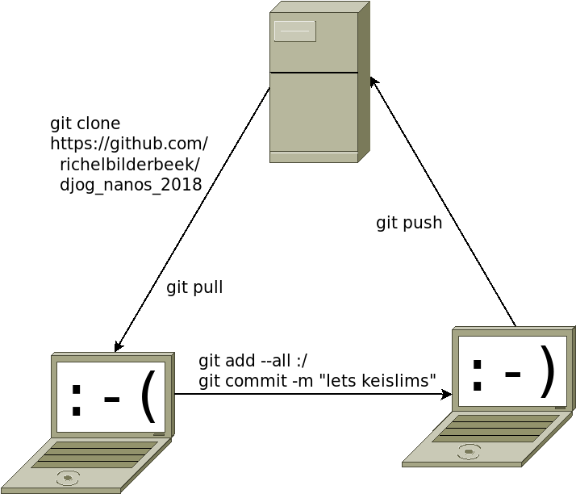
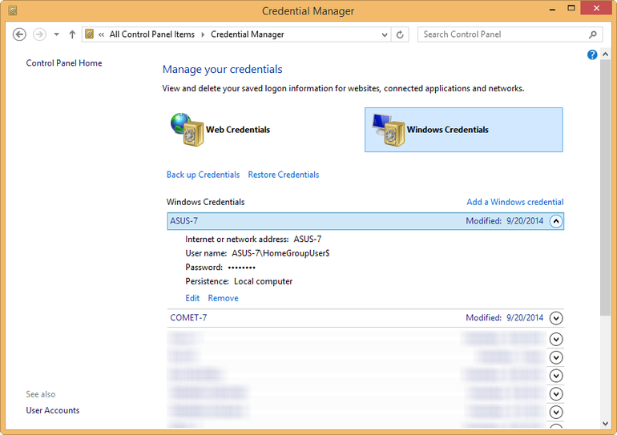
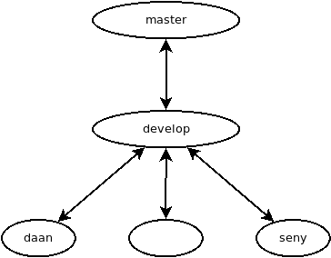

# git_voor_jonge_tieners

Lesmateriaal om git te leren, geschreven voor jonge tieners

## Video's

Onderwerp|YouTube   |Download
---------|----------|--------
git basis|[hier](https://youtu.be/lzIYHH5JbmM)|[hier](http://richelbilderbeek.nl/git_voor_jonge_tieners.ogv)
git merge|[hier](https://youtu.be/hXiwmCwcwko)|[hier](http://richelbilderbeek.nl/git_merge.ogv)

## Wat is `git`?

`git` is een versiebeheersysteem.

## Wat is versiebeheersysteem?

Een versiebeheersysteem houdt de geschiedenis bij van alle veranderingen.
Iedere keer als iemand wat verandert, houdt `git` dat bij.
Hierdoor kun je altijd terug gaan naar eerdere versies.

## Werkwijze `git`

Hier een overzichtje:

 * `0.` instellen wie je bent (een keer per computer)
 * `1.` `git clone`: klonen van de repo
 * `2.` `git add` en `git commit`: jouw veranderingen opslaan
 * `3.` `git push`: jouw code delen met de rest
 * `4.` `git pull`: jouw code updaten met het werk van de rest
 * `5.` De Daan truuk
 * `6.` `git status`: kijken op welke branch je zit
 * `7.` `git checkout richel`: ga naar jouw branch
 * `8.` `git merge develop`: merge develop naar jouw branch

Hieronder wordt het preciezer uitgelegd.



Je kunt ook een video bekijken: [YouTube](https://youtu.be/lzIYHH5JbmM), [download](http://richelbilderbeek.nl/git_voor_jonge_tieners.ogv)

## 0. instellen wie je bent

Om de vorige persoon weg te halen (op Windows):

 * Klik op de Windows toets, type 'Referentiebeheer'



 * Klik op 'Windows Credentials'
 * Zoek 'GitHub' en doe daar 'Verwijderen'


Om in te stellen wie je bent:

Doe in 'Git Bash':

```
git config --global user.name "richelbilderbeek"; git config --global user.email "richel@richelbilderbeek.nl"
```

 * Vul inplaats van `richelbilderbeek` jouw GitHub naam in
 * Vul inplaats van `richel@richelbilderbeek.nl` jouw emailadres naam in

Om uit te vinden wie `git` denkt dat je bent:

```
git config --global user.name; git config --global user.email
```

## 1. `git clone`: klonen van de repo

In een terminal of in Git Bash, type:

```
git clone https://github.com/richelbilderbeek/djog_nanos_2018
```

Nu wordt er een map/folder/directory aangemaakt met de naam `djog_nanos_2018`.

Om in die map te gaan (en dat wil je!), doe je:

```
cd djog_nanos_2018
```


## 2. `git add` en `git commit`: jouw veranderingen opslaan

In de folder `djog_nanos_2018` doe je:

```
git add --all :/
git commit -m "Iets keislims"
```

## 3. `git push`: jouw code delen met de rest

In de folder `djog_nanos_2018` doe je:

```
git push
```

Als `git` een error geeft, update dan eerst jouw code (stap 4, hieronder).

## 4. `git pull`: jouw code updaten met het werk van de rest

In de folder `djog_nanos_2018` doe je:

```
git pull
```

## 5. De Daan truuk: jouw veranderingen opslaan.

In de (Hoofd!)folder `djog_nanos_2018` doe je:

```
start commit.md
```
er opent een programma, laat deze doen wat hij moet doen en sluit hem niet af!
als hij klaar is, dan zie je gepusht! en dan verdwijnt het programma
je hebt gepusht!

## 6. `git status`: kijken op welke branch je zit



```
git status
```

## 7. `git checkout richel`: ga naar jouw branch


In de folder `djog_nanos_2018` doe je:

```
git checkout richel
```

om naar de branch van Richel te gaan. Vul in plaats van `richel` jouw voornaam
in (in enkel kleine letters).

De belangrijkste andere branch:

```
git checkout develop
```

Op `develop` staat de nieuwste versie om onze code.

:warning:: vergeet niet `git pull` te doen 

## 8. `git merge develop`: merge develop naar jouw branch

In de folder `djog_nanos_2018` doe je, als je op jouw branch zit:

```
git merge develop
```

:warning:: `develop` moet geupdate zijn

## Links

 * [C++ voor jonge tieners](https://github.com/richelbilderbeek/cpp_voor_jonge_tieners)
